# zVault Visual Architecture

Interactive Mermaid diagrams for technical discussions. View in any Markdown viewer with Mermaid support (GitHub, VS Code, Notion, etc.).

---

## 1. High-Level System Overview

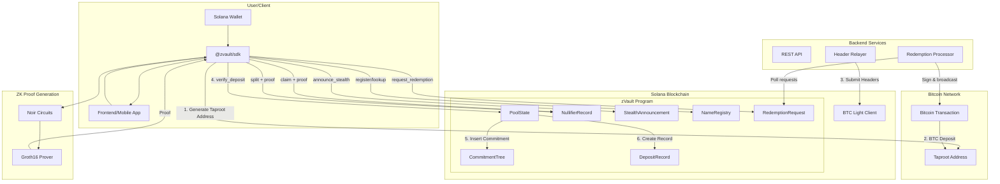

---

## 2. Component Architecture

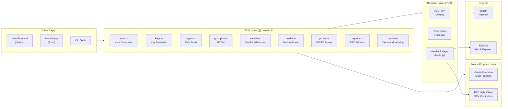

---

## 3. Complete Data Flow: Deposit to Withdrawal

```mermaid
sequenceDiagram
    autonumber
    participant U as User
    participant SDK as SDK
    participant BTC as Bitcoin
    participant HR as Header Relayer
    participant LC as Light Client
    participant ZV as zVault Program
    participant BE as Backend

    rect rgb(40, 60, 80)
    note right of U: Phase 1: Deposit Generation
    U->>SDK: deposit(amount)
    SDK->>SDK: Generate nullifier, secret
    SDK->>SDK: commitment = Poseidon2(Poseidon2(nullifier, secret), amount)
    SDK->>SDK: Derive Taproot address from commitment
    SDK-->>U: Return { taprootAddress, claimLink }
    end

    rect rgb(60, 40, 80)
    note right of U: Phase 2: Bitcoin Deposit
    U->>BTC: Send BTC to Taproot address
    BTC-->>BTC: Transaction confirmed
    HR->>BTC: Poll new block headers
    HR->>LC: Submit block headers
    end

    rect rgb(40, 80, 60)
    note right of U: Phase 3: Deposit Verification
    U->>SDK: verifyDeposit(txid)
    SDK->>SDK: Fetch SPV proof from Esplora
    SDK->>SDK: Upload raw tx to ChadBuffer
    SDK->>ZV: verify_deposit instruction
    ZV->>LC: Verify SPV proof
    ZV->>ZV: Insert commitment to Merkle tree
    ZV->>ZV: Create DepositRecord
    ZV->>ZV: Mint zBTC to pool vault
    ZV-->>SDK: Return leaf_index
    end

    rect rgb(80, 60, 40)
    note right of U: Phase 4: Private Claim (ZK)
    U->>SDK: claim(claimLink)
    SDK->>SDK: Parse nullifier, secret, amount
    SDK->>SDK: Generate Groth16 proof
    SDK->>ZV: claim instruction + proof
    ZV->>ZV: Verify Groth16 proof (alt_bn128)
    ZV->>ZV: Check nullifier not spent
    ZV->>ZV: Create NullifierRecord
    ZV-->>U: Claim successful
    end

    rect rgb(80, 40, 60)
    note right of U: Phase 5: Withdrawal
    U->>SDK: withdraw(note, btcAddress)
    SDK->>SDK: Generate withdrawal ZK proof
    SDK->>ZV: request_redemption + proof
    ZV->>ZV: Verify proof
    ZV->>ZV: Create RedemptionRequest
    ZV->>ZV: Burn zBTC from pool
    BE->>ZV: Poll pending requests
    BE->>BTC: Sign & broadcast BTC tx
    BE->>ZV: Update status = Completed
    BTC-->>U: Receive BTC
    end
```

---

## 4. Stealth Address Transfer Flow

```mermaid
sequenceDiagram
    autonumber
    participant S as Sender
    participant SDK as SDK
    participant ZV as zVault Program
    participant R as Recipient

    rect rgb(50, 70, 90)
    note right of R: Recipient Setup
    R->>SDK: Generate stealth meta address
    SDK->>SDK: Generate Grumpkin keypairs
    SDK-->>R: { spendingPub, viewingPub }
    R-->>S: Share meta address (QR/link)
    end

    rect rgb(70, 50, 90)
    note right of S: Sender Creates Stealth Deposit
    S->>SDK: sendStealth(recipientMeta, amount)
    SDK->>SDK: Generate ephemeral Grumpkin keypair
    SDK->>SDK: sharedSecret = ECDH(ephemeralPriv, viewingPub)
    SDK->>SDK: stealthPub = spendingPub + hash(sharedSecret) * G
    SDK->>SDK: commitment = Poseidon2(stealthPub.x, amount)
    SDK->>ZV: announce_stealth(ephemeralPub, commitment, amount)
    ZV->>ZV: Create StealthAnnouncement
    ZV->>ZV: Insert commitment to tree
    ZV-->>SDK: Return leaf_index
    SDK-->>S: { signature, ephemeralPub }
    end

    rect rgb(90, 70, 50)
    note right of R: Recipient Scans & Claims
    R->>ZV: Fetch all StealthAnnouncements
    loop For each announcement
        R->>SDK: Check if mine
        SDK->>SDK: sharedSecret = ECDH(viewingPriv, ephemeralPub)
        SDK->>SDK: stealthPub = spendingPub + hash(sharedSecret) * G
        SDK->>SDK: Verify commitment == Poseidon2(stealthPub.x, amount)
    end
    R->>SDK: Found matching announcement!
    SDK->>SDK: stealthPriv = spendingPriv + hash(sharedSecret)
    SDK->>SDK: Generate claim ZK proof with stealthPriv
    SDK->>ZV: claim instruction + proof
    ZV-->>R: Claim successful
    end
```

---

## 5. Split Operation Flow (1-in-2-out)

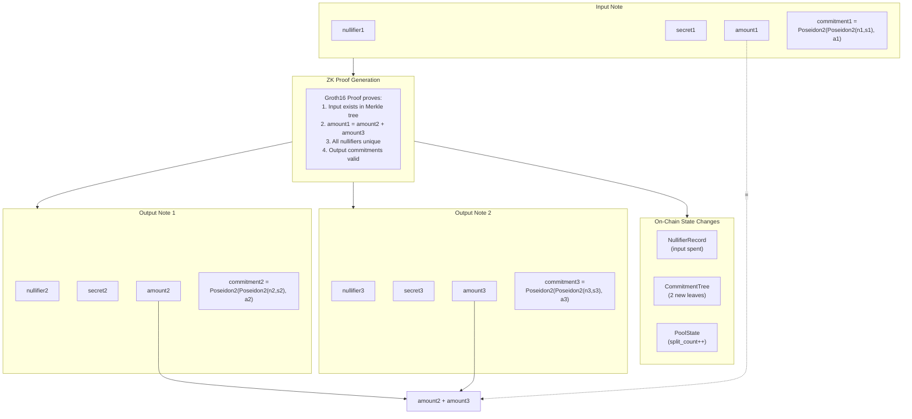

---

## 6. Account Structure (PDAs)

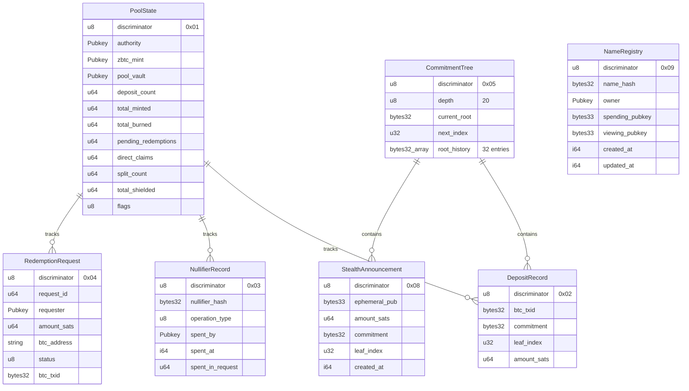

---

## 7. Cryptographic Pipeline

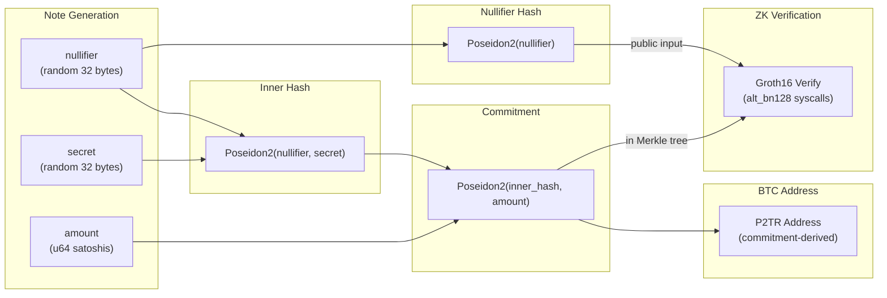

---

## 8. Privacy Model

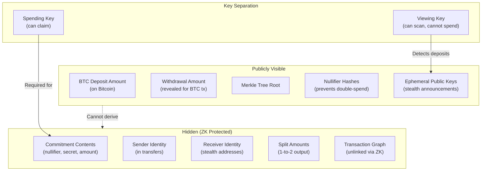

---

## 9. Instruction Flow Map

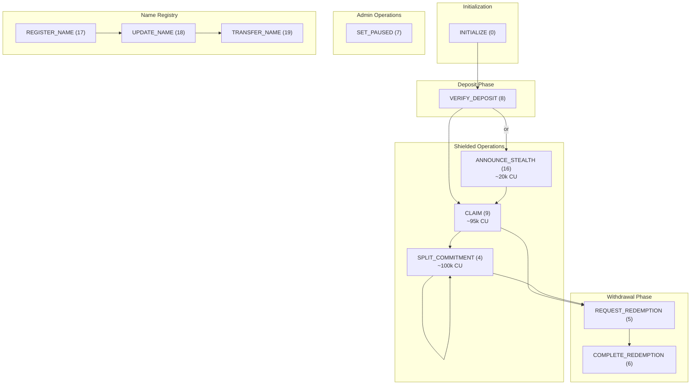

---

## 10. Technology Stack

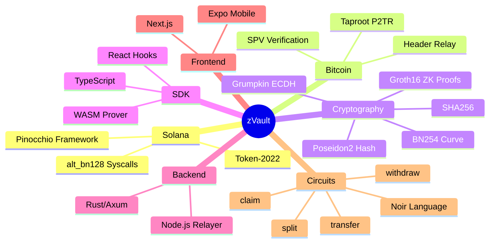

---

## 11. Deployment Architecture

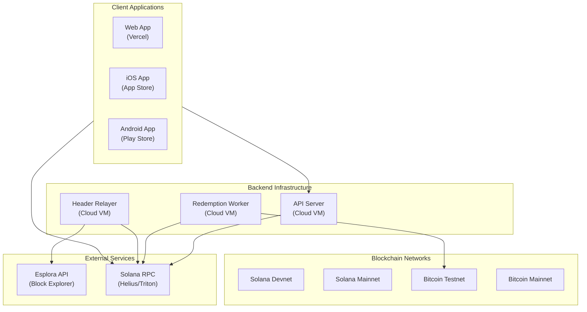

---

## 12. User Journey Map

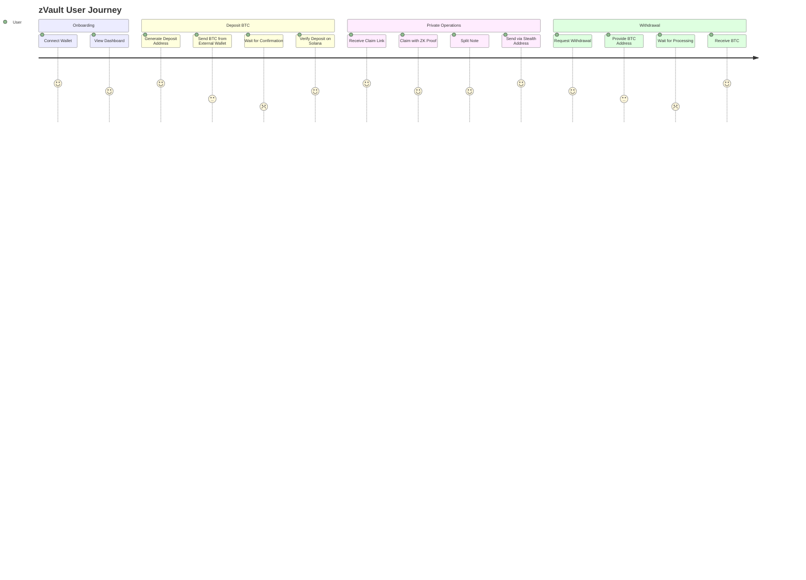

---

## 13. State Machine: Redemption Request

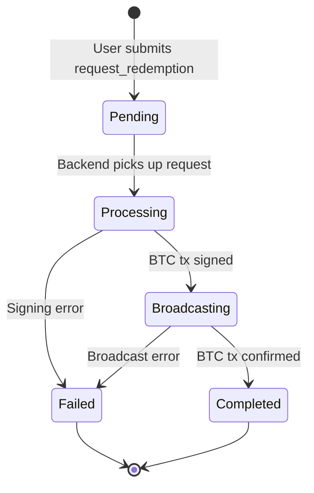

---

## 14. C4 Context Diagram

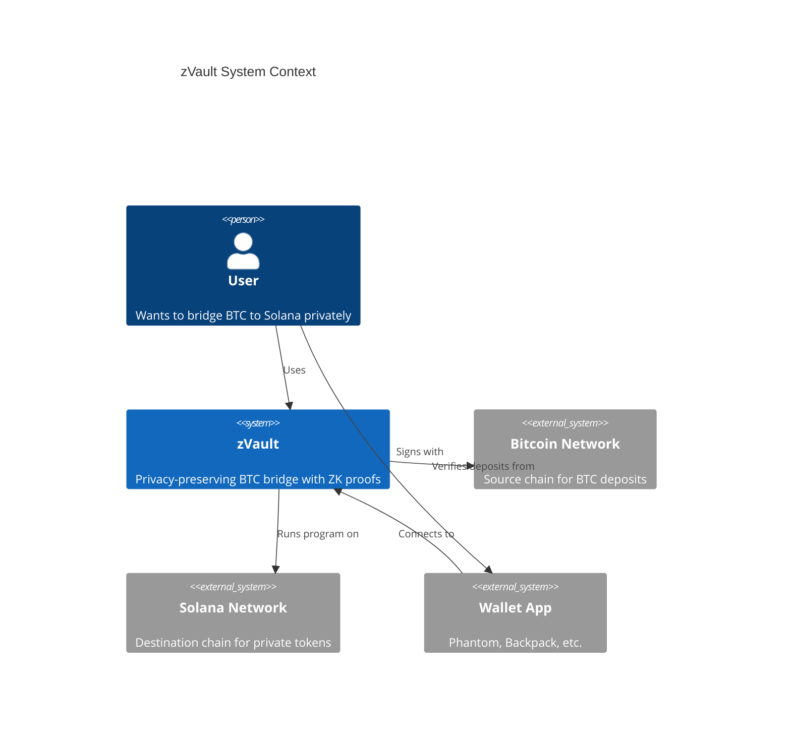

---

## 15. Complete Flow Summary

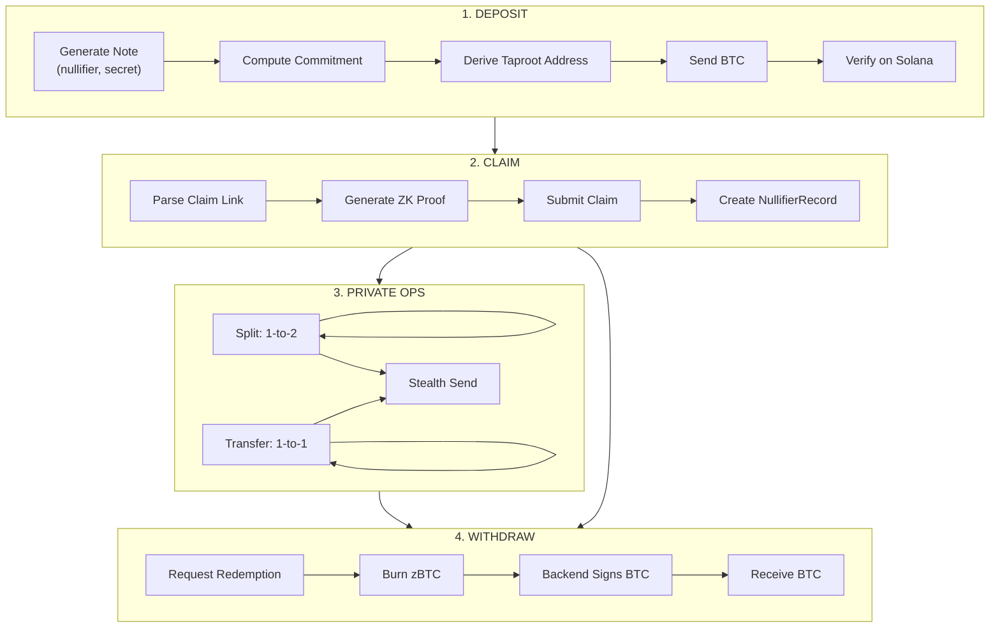

---

## Quick Reference

### Program IDs

| Component | Network | Address |
|-----------|---------|---------|
| zVault Program | Devnet | `CBzbSQPcUXMYdmSvnA24HPZrDQPuEpq4qq2mcmErrWPR` |
| BTC Light Client | Devnet | `8GCjjPpzRP1DhWa9PLcRhSV7aLFkE8x7vf5royAQzUfG` |

### PDA Seeds

| Account | Seeds |
|---------|-------|
| PoolState | `["pool_state"]` |
| CommitmentTree | `["commitment_tree"]` |
| DepositRecord | `["deposit", txid]` |
| NullifierRecord | `["nullifier", nullifier_hash]` |
| RedemptionRequest | `["redemption", request_id]` |
| StealthAnnouncement | `["stealth", ephemeral_pub]` |
| NameRegistry | `["zkey", name_hash]` |

### Instruction Discriminators

| Disc | Name | CU |
|------|------|----|
| 0 | INITIALIZE | - |
| 4 | SPLIT_COMMITMENT | ~100k |
| 5 | REQUEST_REDEMPTION | ~95k |
| 6 | COMPLETE_REDEMPTION | - |
| 7 | SET_PAUSED | - |
| 8 | VERIFY_DEPOSIT | ~200k |
| 9 | CLAIM | ~95k |
| 16 | ANNOUNCE_STEALTH | ~20k |
| 17-19 | NAME_REGISTRY_OPS | - |

---

## How to View

1. **GitHub**: Push to repo, view on GitHub (native Mermaid support)
2. **VS Code**: Install "Mermaid Preview" extension
3. **Notion**: Paste Mermaid code in code block with "mermaid" language
4. **Online**: Use [mermaid.live](https://mermaid.live) to edit/export
5. **Export**: Generate PNG/SVG from mermaid.live for presentations
